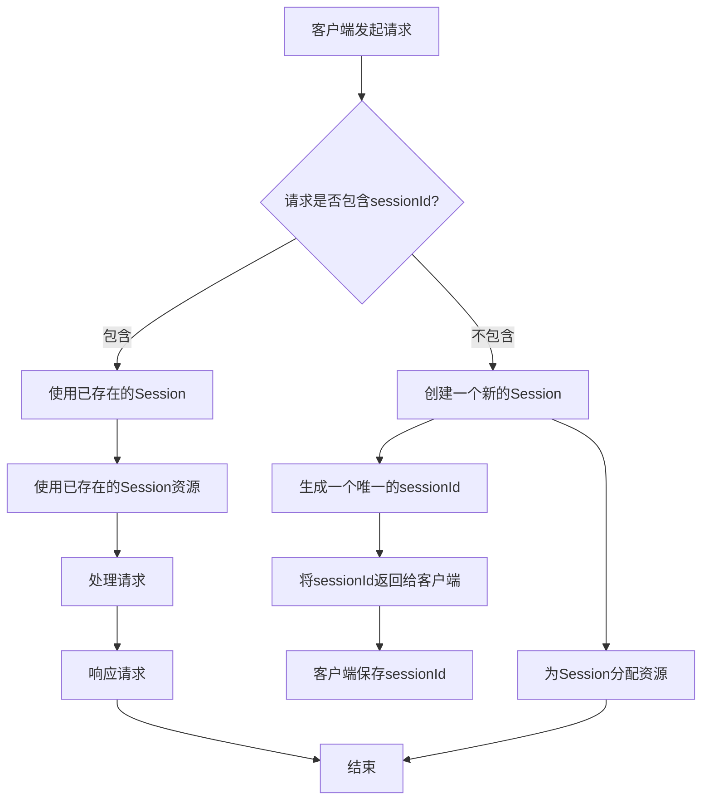

HTTP无状态（<u>一旦数据交换完毕，客户端与服务器端的连接就会关闭，再次交换数据需要建立新的连接</u>），引入`cookie` 、`session`维持和跟踪用户状态。

 

> `Session`
>
> ​	用户与服务器建立连接的同时，服务器会自动为其分配一个SessionId
>
> ​	cookie每次请求都把SessionId自动带到服务器
>
> ​		当一个用户提交了表单时，浏览器会将用户的SessionId自动附加在HTTP头信息中，（这是浏览器的自动功能，用户不会察觉到），当服务器处理完这个表单后，将结果返回给SessionId所对应的用户。

 

* ### 存储位置不同:

  - Cookie数据存放在客户的**浏览器**上

  - Session数据放在**服务器**上

* ### 安全性不同:

  - Cookie不是很安全,别人可以分析存放在本地的COOKIE并进行COOKIE欺骗

  - Session存放在服务器上,比较安全

* ### 大小限制不同:

  * Cookie大小有**限制**,最大<u>4K</u>左右

  - Session大小一般可设置<u>1M到几十M</u>,根据服务器的内存大小而定

* ### 有效期不同:

  - Cookie的有效期需要程序员**自己设置**

  - Session的有效期默认到**浏览器关闭**时失效

* ### 作用范围不同:

  * Cookie被客户端记录,每次请求时都会携带,对于服务器请求数量多的情况下会增加请求数据量

  - Session只保存在服务器端,不会增加请求数据量

* ### 实现机制不同:

  - Cookie通过检查客户浏览器的cookie来确定客户身份

  - Session通过给客户浏览器分配一个**特定的ID**来识别客户身份。服务器通过匹配session ID来管理session

